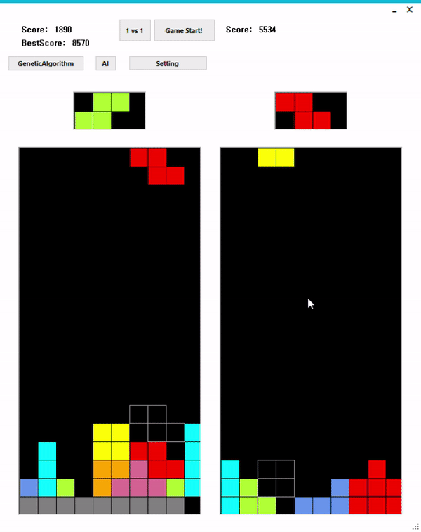
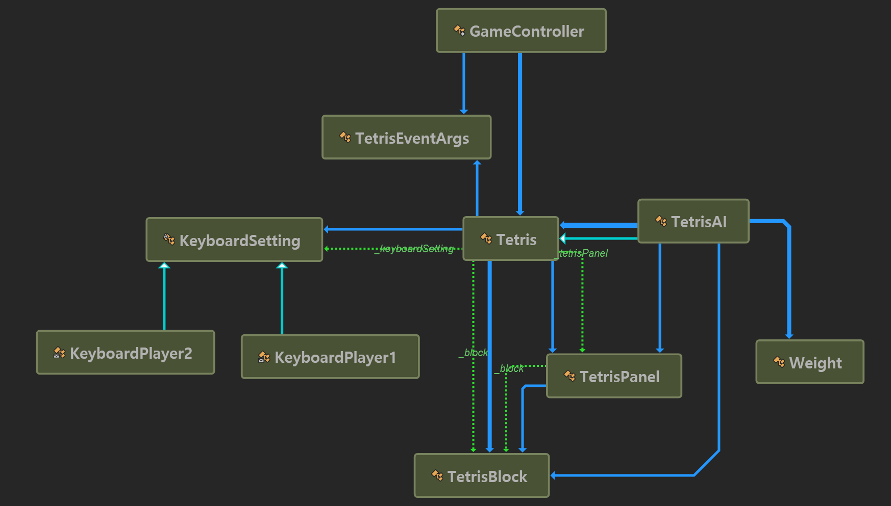

# Winform Tetris
winform으로 만든 테트리스 입니다.

| Player vs AI | Genetic Algorithm |
| --- | --- |
|  |  |

## 기능
- Genetic Algorithm 을 이용한 AI 학습
- 학습된 AI와 1:1 대결
- 친구와 1:1 대결

## 게임 방법 
<table>
  <tr>
    <td colspan="2" align="center">Player 1</td>
    <td colspan="2" align="center">Player 2</td>
  </tr>
  <tr>
    <td align="center">Key</td>
    <td align="center">Action</td>
    <td align="center">Key</td>
    <td align="center">Action</td>
  </tr>
  <tr>
    <td>↑</td>
    <td>오른쪽 회전</td>
    <td>W</td>
    <td>오른쪽 회전</td>
  </tr>
  <tr>
    <td>↓</td>
    <td>소프트 드롭</td>
    <td>S</td>
    <td>소프트 드롭</td>
  </tr>
  <tr>
    <td>←</td>
    <td>왼쪽 이동</td>
    <td>A</td>
    <td>왼쪽 이동</td>
  </tr>
  <tr>
    <td>→</td>
    <td>오른쪽 이동</td>
    <td>D</td>
    <td>오른쪽 이동</td>
  </tr>
  <tr>
    <td>NumPad 0</td>
    <td>하드 드롭</td>
    <td>E</td>
    <td>하드 드롭</td>
  </tr>
</table>

## 클래스 다이어그램

## 개발 환경
.net framework 4.7.2, Visual Studio 2019
